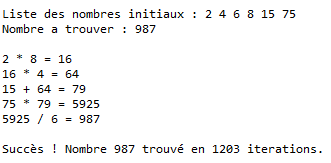

# Compte-est-Bon
This is a Java school project. From a list of digit this app is able to determinate what sequence of operations (ADD, MULT, DIV, SUBS) we need to obtain a certain number.\
# Example output

